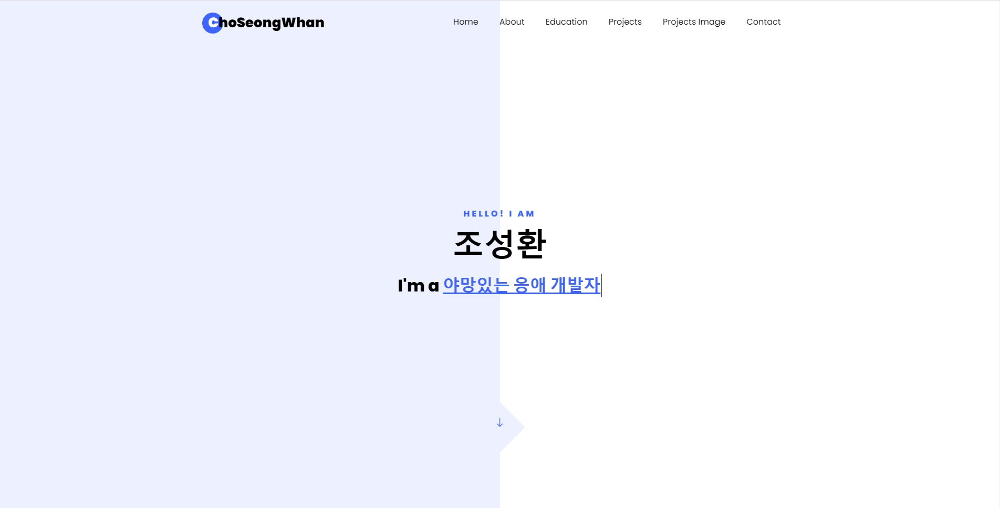
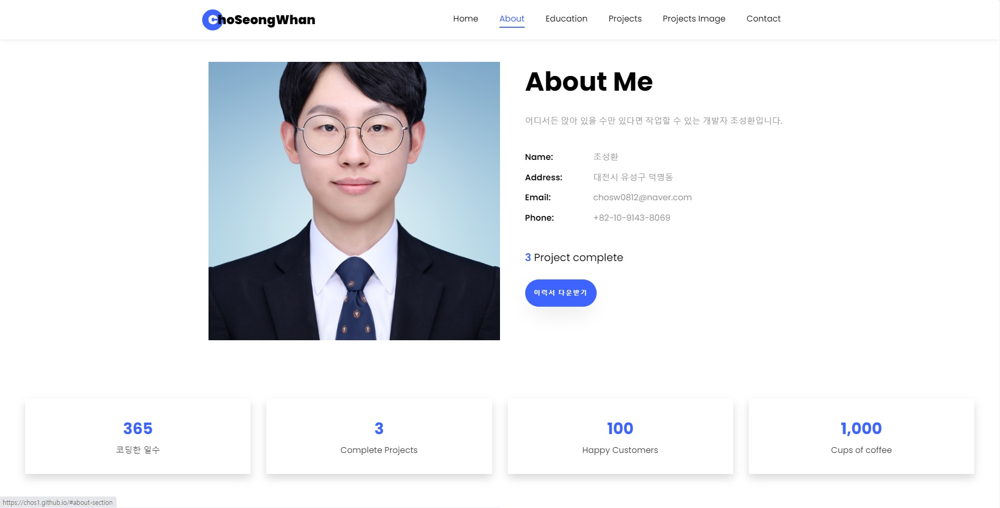
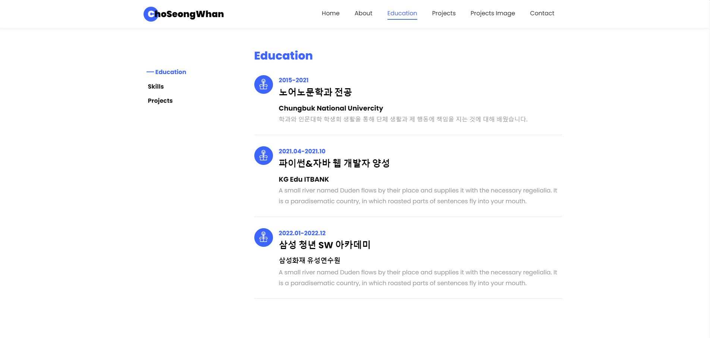
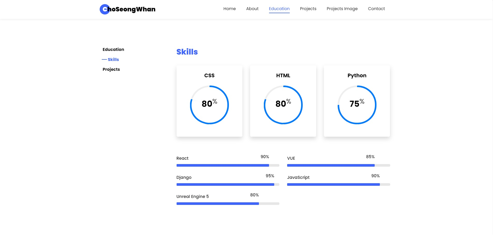
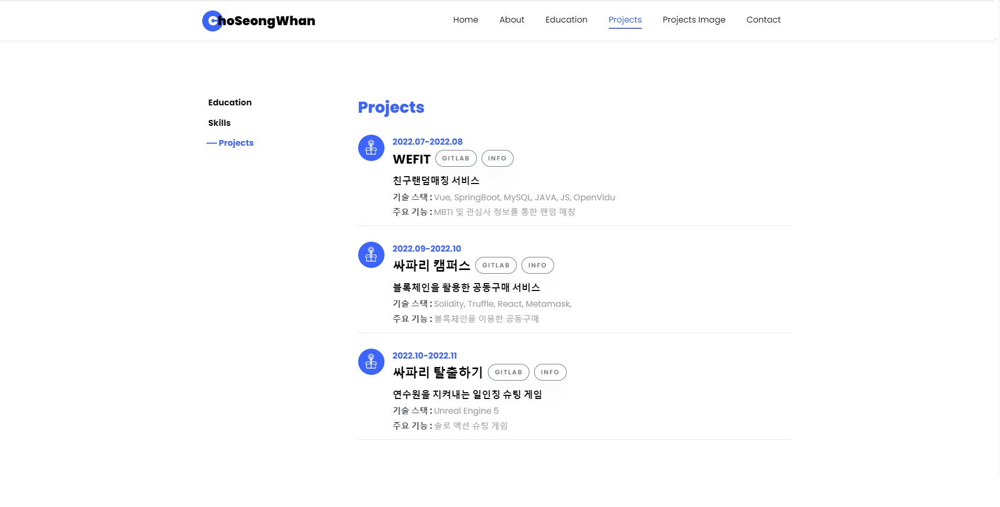
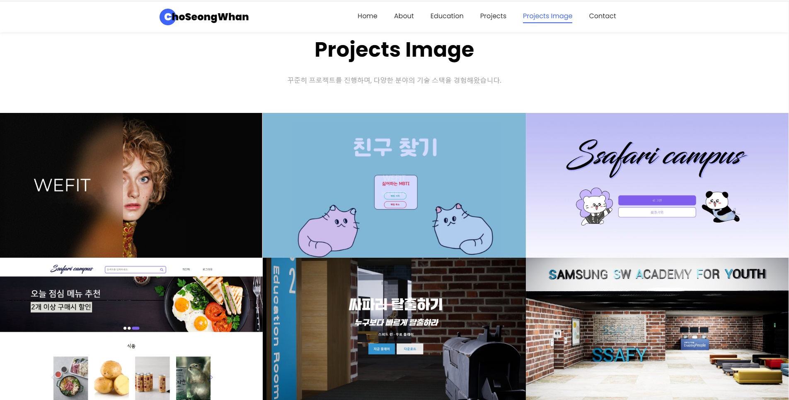
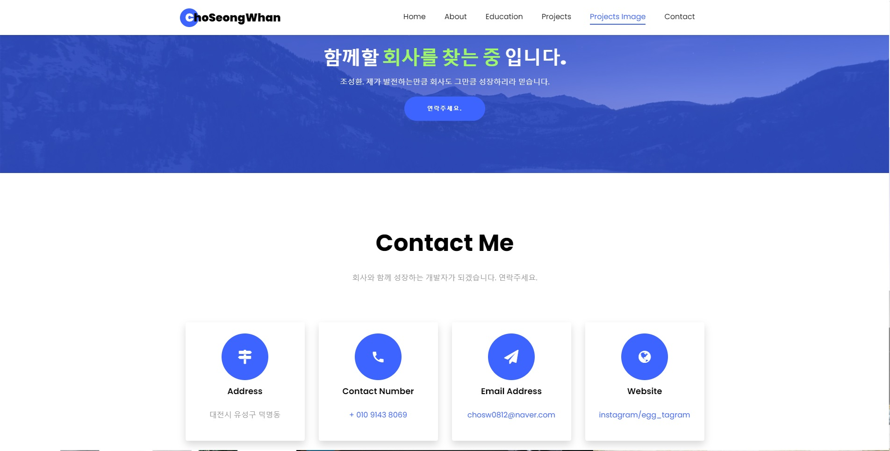

# portfolio

## 포트폴리오 설명

### 메인페이지
 *메인 스크린샷*
- 본인 한 줄 소개
  - js 사용해서 한 줄 소개를 포함해 여러가지 내용 작성

### About 페이지
 *About 스크린샷*
- 본인 개요

### Education 페이지
 *Educations 스크린샷*
- 학업 

### Skill 페이지
 *Skill 스크린샷*
- 사용할 수 있는 기술 스택과 정도

### Project 페이지
 *Project 스크린샷*
 - 싸피에서 진행한 프로젝트와 정보

### Project_image 페이지
 *Project images 스크린샷*
 - 프로젝트 이미지 및 링크

### Contact 페이지
 *contact 스크린샷*
 - 그 외 간단한 정보 